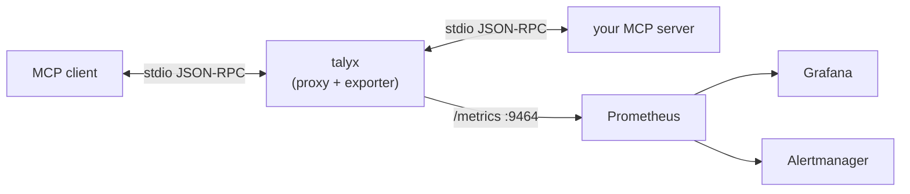

# talyx-mcp

English | [繁體中文](README.zh-TW.md)

[](https://github.com/alan66603/talyx)
[](https://opensource.org/licenses/Apache-2.0)
[](https://www.python.org/downloads/)
[](https://modelcontextprotocol.io)
[](https://github.com/astral-sh/ruff)

**Prometheus exporter and alerting for MCP servers.** When your MCP server breaks, your users just see a broken agent—you see exactly which server failed, how slow it got, and when. Wrap any stdio server, **zero code changes**.

Talyx is a **zero-code proxy**: it sits between your MCP client and server,
forwards the stdio JSON-RPC untouched, and exports Prometheus metrics about the
traffic. It ships with a Grafana dashboard and Alertmanager rules. It is
**stateless** — no database, Prometheus just scrapes `/metrics`.



## Table of Contents

- [talyx-mcp](#talyx-mcp)
  - [Table of Contents](#table-of-contents)
  - [Quickstart (the demo)](#quickstart-the-demo)
  - [Use it on your own server](#use-it-on-your-own-server)
  - [Metrics](#metrics)
  - [How it works](#how-it-works)
  - [Roadmap](#roadmap)
  - [License](#license)
  - [Author](#author)

## Quickstart (the demo)

Runs talyx + a sample MCP server + Prometheus + Alertmanager + Grafana, with
live traffic, in one command:

```bash
git clone https://github.com/alan66603/talyx-mcp.git
cd talyx-mcp
docker compose -f deploy/compose/demo.yaml up --build
```

Then open **http://localhost:3000** → dashboard **MCP Overview** (anonymous, no
login). You'll see request rate, error rate, p95 latency, and the flagship
**Multi Round-Trip** panels — elicitation loops, round-trips per request, and
**abandoned cycles** (agents silently stuck waiting on a confirmation) — updating
live. Prometheus is on `:9090`, Alertmanager on `:9093`.

## Use it on your own server

Point your MCP client at `talyx` instead of the server, and pass the real
command after `--`:

```jsonc
// before
{ "command": "npx", "args": ["-y", "@modelcontextprotocol/server-everything"] }

// after — same server, now observed
{ "command": "talyx", "args": ["--", "npx", "-y", "@modelcontextprotocol/server-everything"] }
```

Metrics are then at `http://localhost:9464/metrics`. Install with
`pip install .` (or use the image at `deploy/docker/Dockerfile`). Configure the
port with `TALYX_METRICS_PORT` / `TALYX_METRICS_HOST`. To also push metrics
over OTLP, set `TALYX_OTLP_ENDPOINT` and install the extra:
`pip install '.[otlp]'` (Prometheus `/metrics` stays on regardless).

> The flagship cycle metrics need a server that speaks MCP `2026-07-28`
> (`InputRequiredResult`). Wrapping an older server still gives you the core
> reliability metrics; to see the cycle panels, try the bundled mock server:
> `talyx -- python -m talyx.mock.server`.

## Metrics

Aligned to the MCP `2026-07-28` (stateless) spec. Full reference:
[docs/metrics.md](https://github.com/alan66603/talyx/blob/main/docs/metrics.md).

**Core reliability**

| Metric | Type | Labels |
|---|---|---|
| `talyx_requests_total` | counter | `method`, `server`, `status` |
| `talyx_request_duration_seconds` | histogram | `method`, `server` |
| `talyx_errors_total` | counter | `method`, `server`, `error_code` |

**Multi Round-Trip cycles — the flagship.** In MCP's latest version, `2026-07-28` server can answer a
`tools/call` with an `InputRequiredResult` and the client re-sends with the
server's `requestState`; that elicitation loop is one *logical* request that
generic APM reads as two unrelated ones.

| Metric | Type | Labels |
|---|---|---|
| `talyx_input_required_total` | counter | `method`, `server`, `wait_type` |
| `talyx_round_trips_per_request` | histogram | `wait_type` |
| `talyx_round_trip_cycle_duration_seconds` | histogram | `wait_type` |
| `talyx_input_wait_duration_seconds` | histogram | `server`, `wait_type` |
| `talyx_abandoned_cycles_total` | counter | `server`, `wait_type` |
| `talyx_request_state_rejected_total` | counter | `server` |

Plus basic liveness (`talyx_server_up`, `talyx_inflight_requests_lost_total`) and
`talyx_proxy_overhead_seconds`.

**`talyx_abandoned_cycles_total`** counts cycles where the server sent an
`InputRequired` but got no follow-up. No error, no timeout, which can be overlooked. A single count means little (users pause or walk away), but a spike
above baseline usually signals a broken or confusing prompt, especially around
high-risk `InputRequiredResult` gates.

**Security:** Talyx records *no tool arguments* and no message bodies — only
method/tool names, outcomes, and timings. The one correlation key it needs (the
sealed `requestState` token) is **hashed in memory and never stored** See [docs/metrics.md](https://github.com/alan66603/talyx/blob/main/docs/metrics.md).

**Overhead:** talyx's own per-chunk processing is sub-millisecond
(`talyx_proxy_overhead_seconds`), so it doesn't meaningfully slow the server down.

## How it works

The proxy forwards bytes in both directions untouched and observes the
JSON-RPC as a side-channel — if observation ever fails, forwarding is
unaffected. It's stateless by design, which is the core difference from
trace-based tools. See [docs/architecture.md](https://github.com/alan66603/talyx/blob/main/docs/metrics.md)
for the positioning table and the "why a proxy, not an SDK" rationale.

## Roadmap

Optional OTLP **metrics** export already ships (`TALYX_OTLP_ENDPOINT`), and
the proxy forwards W3C `traceparent` untouched. Still ahead: OTLP **trace/span**
export (to your own Tempo/Jaeger), HTTP transport + OAuth, a Helm chart, and
optional body capture. Token usage isn't visible in MCP protocol traffic, so
Talyx does not claim token metrics.

## License

Apache-2.0. See [LICENSE](LICENSE).

## Author

[](https://www.linkedin.com/in/tsung-yao-chen-75481718b)
