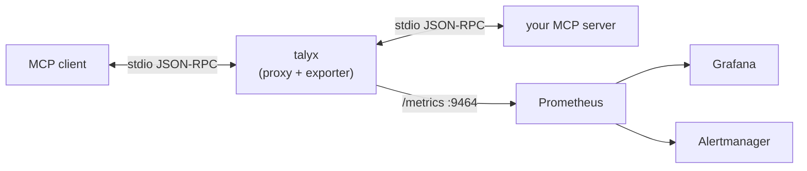

# Talyx

[English](README.md) | 繁體中文

[](https://opensource.org/licenses/Apache-2.0)
[](https://www.python.org/downloads/)
[](https://modelcontextprotocol.io)
[](https://github.com/astral-sh/ruff)

**給 MCP server 用的 Prometheus 匯出器與告警工具。** 把它包在任何 stdio MCP server
外面，**不必改一行程式碼**，就能在 server 壞掉或變慢的當下馬上知道，且讓你可以確切知道壞掉的地方。

Talyx 是一個 zero-code proxy：它坐在你的 MCP client 與 server 之間，原封不動地轉發
stdio JSON-RPC，並把流量的 Prometheus 指標匯出。內附一組 Grafana dashboard 與
Alertmanager 規則。它是 **stateless** 的——沒有資料庫，Prometheus 直接抓 `/metrics`。



## 目錄

- [Talyx](#talyx)
  - [目錄](#目錄)
  - [Quick Start](#quick-start)
  - [如何用在你自己的 server](#如何用在你自己的-server)
  - [指標](#指標)
  - [運作方式](#運作方式)
  - [Roadmap](#roadmap)
  - [License](#license)
  - [作者](#作者)

## Quick Start

一行指令跑起 talyx + 一個範例 MCP server + Prometheus + Alertmanager + Grafana，
外加即時流量：

```bash
git clone https://github.com/alan66603/talyx.git
cd talyx
docker compose -f deploy/compose/demo.yaml up --build
```

接著打開 **http://localhost:3000** → dashboard **MCP Overview**（匿名，免登入）。
你會看到 request rate、error rate、p95 latency，以及招牌的 **Multi Round-Trip** 面板
——elicitation 循環、每個請求的往返次數，還有 **abandoned cycles**（agent 靜默卡在
等一個永遠不來的確認）——全部即時更新。Prometheus 在 `:9090`，Alertmanager 在 `:9093`。

## 如何用在你自己的 server

把你的 MCP client 指向 `talyx`（而不是 server），真正的指令放在 `--` 後面：

```jsonc
// 改之前
{ "command": "npx", "args": ["-y", "@modelcontextprotocol/server-everything"] }

// 改之後——同一個 server，現在被觀測了
{ "command": "talyx", "args": ["--", "npx", "-y", "@modelcontextprotocol/server-everything"] }
```

指標就會在 `http://localhost:9464/metrics`。用 `pip install .` 安裝（或用
`deploy/docker/Dockerfile` 的映像）。用 `TALYX_METRICS_PORT` / `TALYX_METRICS_HOST`
設定埠號。若還想把指標推到 OTLP，設 `TALYX_OTLP_ENDPOINT` 並裝上額外相依：
`pip install '.[otlp]'`（Prometheus `/metrics` 一律照常開著）。

> 招牌的循環指標需要一個講 MCP `2026-07-28`（會回 `InputRequiredResult`）的 server。
> 包在舊 server 上仍能拿到核心可靠性指標；想看循環面板，可以用內附的 mock server：
> `talyx -- python -m talyx.mock.server`。

## 指標

對齊 MCP `2026-07-28`（stateless）規格。完整參考：[docs/metrics.zh-TW.md](docs/metrics.zh-TW.md)。

**核心可靠性**

| 指標 | 型別 | Labels |
|---|---|---|
| `talyx_requests_total` | counter | `method`、`server`、`status` |
| `talyx_request_duration_seconds` | histogram | `method`、`server` |
| `talyx_errors_total` | counter | `method`、`server`、`error_code` |

**Multi Round-Trip 循環** MCP `2026-07-28` 版本更新後，server 可以用
`InputRequiredResult` 回應 `tools/call`，client 再帶著 server 的 `requestState` 重送；
這個 elicitation 循環是**一個**邏輯請求，但通用 APM 會把它讀成兩個不相干的請求。

| 指標 | 型別 | Labels |
|---|---|---|
| `talyx_input_required_total` | counter | `method`、`server`、`wait_type` |
| `talyx_round_trips_per_request` | histogram | `wait_type` |
| `talyx_round_trip_cycle_duration_seconds` | histogram | `wait_type` |
| `talyx_input_wait_duration_seconds` | histogram | `server`、`wait_type` |
| `talyx_abandoned_cycles_total` | counter | `server`、`wait_type` |
| `talyx_request_state_rejected_total` | counter | `server` |

另有基礎 liveness（`talyx_server_up`、`talyx_inflight_requests_lost_total`）與
`talyx_proxy_overhead_seconds`。

**`talyx_abandoned_cycles_total`** 記錄 server 發出 `InputRequired` 卻沒等到
回覆的循環。這在新版本不算 error 也沒有 timeout, 因此是容易被忽略的行爲。單次計數並無代表性(使用者可能
只是離開)，但比率異常升高可能表示提示壞了或令人困惑，在高風險的
`InputRequiredResult` 把關處值得參考。

**隱私與安全：** Talyx **不記錄任何 tool 參數**、不記錄訊息內容，只取 method/tool
名稱、結果與時間。它唯一需要的關聯鍵（密封的 `requestState` token）**在記憶體內雜湊、
絕不落地**。詳見 [docs/metrics.zh-TW.md](docs/metrics.zh-TW.md)。

**額外開銷：** talyx 自身每個 chunk 的處理是次毫秒等級（`talyx_proxy_overhead_seconds`），
所以不會實質拖慢 server。

## 運作方式

proxy 在兩個方向都原封轉發位元組，把 JSON-RPC 當旁路（side-channel）觀測——就算觀測
失敗，轉發也不受影響。它天生 stateless，這是與 trace 類工具的核心
差異。

## Roadmap

可選的 OTLP **metrics** 匯出已經有了（`TALYX_OTLP_ENDPOINT`），proxy 也會原封轉發
W3C `traceparent`。還在路上：OTLP **trace/span** 匯出（推到你自己的 Tempo/Jaeger）、
HTTP transport + OAuth、Helm chart，以及可選的 body capture。token 用量在 MCP 協定
流量中看不到，所以 Talyx 刻意不宣稱 token 指標。

## License

Apache-2.0。見 [LICENSE](LICENSE)。

## 作者

[](https://www.linkedin.com/in/tsung-yao-chen-75481718b)
